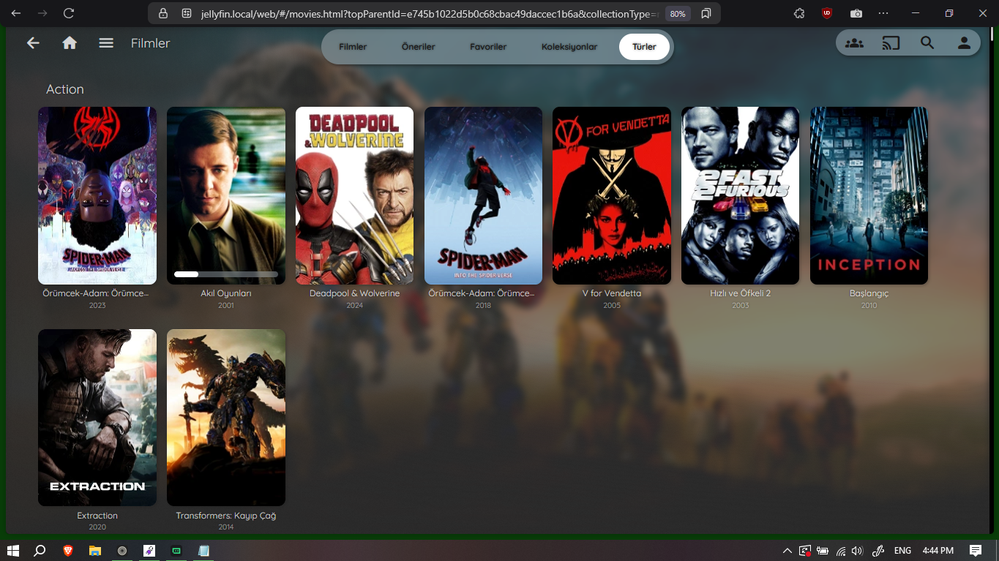

<video src="./show.mp4" controls loop muted autoplay width="100%"></video>

# JellyfinTheme

[Ultrachromic](https://github.com/CTalvio/Ultrachromic), [Glassmorphism](https://github.com/alexyle/jellyfin-theme), [Scyfin](https://github.com/loof2736/scyfin), [JellyTheme](https://github.com/alexyle/jellyfin-theme) ve [Zombie](https://github.com/MakD/zombie-release/tree/main) temalarından esinlenerek oluşturulmuş, Jellyfin için minimalist ve zarif bir tema.


---
(GEREKLİ) **BU TEMAYI BU EKLENTİLER İLE BERABER KULLANIN!**

---
### **Ekran Görüntüleri:**




Two login wallpaper options: Minimal and Stylish.


**Mobile:**


---

## Kurulum

Benim kullandığım temayı Jellyfin'e eklemek için aşağıdaki satırı Dashboard > General > Custom CSS bölümüne kopyalayın:

```
@import url('https://cdn.jsdelivr.net/gh/ArdaYILDIZ-DEV/JellyfinTheme@latest/round-icons.css');
@import url('https://cdn.jsdelivr.net/gh/ArdaYILDIZ-DEV/JellyfinTheme@latest/theme.css');
@import url('https://fonts.googleapis.com/icon?family=Material+Icons');
@import url('https://cdn.jsdelivr.net/gh/ArdaYILDIZ-DEV/JellyfinTheme@latest/colorschemes/gray.css');

.adminDrawerLogo img {
  content: url(https://cdn.jsdelivr.net/gh/ArdaYILDIZ-DEV/JellyfinTheme@latest/affine-light.webp) !important;
}

imgLogoIcon {
  content: url(https://cdn.jsdelivr.net/gh/ArdaYILDIZ-DEV/JellyfinTheme@latest/affine-light.webp) !important;
}

.pageTitleWithLogo {
  background-image: url(https://cdn.jsdelivr.net/gh/ArdaYILDIZ-DEV/JellyfinTheme@latest/affine-light.webp) !important;
}

```

Daha sonra, eğer yapmadıysanız, bu temayı kullanacak _her_ cihaz için Arka Planları etkinleştirin (Ayarlar > Görüntü > Arka Planlar).¹

## Renk Şemaları

Varsayılan renkleri aşağıdaki ön ayarlardan birine değiştirmek isterseniz (isteğe bağlı) aşağıdaki @import satırlarından **birini** ekleyin:

### Açık Mavi


Varsayılan renk şeması.

<details>
 <summary>Önizleme</summary>
 <div class="collapsible-content">
    
    
 </div>
</details>
<br>

### Mavi


```css
@import url('https://cdn.jsdelivr.net/gh/ArdaYILDIZ-DEV/JellyfinTheme@latest/colorschemes/blue.css');
```

<details>
 <summary>Önizleme</summary>
 <div class="collapsible-content">
    
    
 </div>
</details>
<br>

### Mercan


```css
@import url('https://cdn.jsdelivr.net/gh/ArdaYILDIZ-DEV/JellyfinTheme@latest/colorschemes/coral.css');
```

<details>
 <summary>Önizleme</summary>
 <div class="collapsible-content">
    
    
 </div>
</details>
<br>

### Gri


```css
@import url('https://cdn.jsdelivr.net/gh/ArdaYILDIZ-DEV/JellyfinTheme@latest/colorschemes/gray.css');
```

<details>
 <summary>Önizleme</summary>
 <div class="collapsible-content">
    
    
 </div>
</details>
<br>

### Yeşil


```css
@import url('https://cdn.jsdelivr.net/gh/ArdaYILDIZ-DEV/JellyfinTheme@latest/colorschemes/green.css');
```

<details>
 <summary>Önizleme</summary>
 <div class="collapsible-content">
    
    
 </div>
</details>
<br>

### Mor


```css
@import url('https://cdn.jsdelivr.net/gh/ArdaYILDIZ-DEV/JellyfinTheme@latest/colorschemes/purple.css');
```

<details>
 <summary>Önizleme</summary>
 <div class="collapsible-content">
    
    
 </div>
</details>
<br>

### Kırmızı


```css
@import url('https://cdn.jsdelivr.net/gh/ArdaYILDIZ-DEV/JellyfinTheme@latest/colorschemes/red.css');
```

<details>
 <summary>Önizleme</summary>
 <div class="collapsible-content">
    
    
 </div>
</details>
<br>

### Sarı


```css
@import url('https://cdn.jsdelivr.net/gh/ArdaYILDIZ-DEV/JellyfinTheme@latest/colorschemes/yellow.css');
```

<details>
 <summary>Önizleme</summary>
 <div class="collapsible-content">
    
    
 </div>
</details>
<br>
<br>


### Alternatif Giriş Ekranı Duvar Kağıdı
Son olarak, alternatif (şık) giriş ekranı duvar kağıdını kullanmak isterseniz, aşağıdaki satırı Özel CSS'nize ekleyin:

```css
@import url('https://cdn.jsdelivr.net/gh/ArdaYILDIZ-DEV/JellyfinTheme@latest/login-alt.css');
```

Bu, minimalist (varsayılan) ve şık giriş ekranı duvar kağıdı versiyonları arasındaki bir karşılaştırmadır:

<details>
 <summary>Mavi</summary>
 <div class="collapsible-content">
    
    
 </div>
</details>

<details>
 <summary>Mercan</summary>
 <div class="collapsible-content">
    
    
 </div>
</details>

<details>
 <summary>Açık Mavi</summary>
 <div class="collapsible-content">
    
    
 </div>
</details>

<details>
 <summary>Gri</summary>
 <div class="collapsible-content">
    
    
 </div>
</details>

<details>
 <summary>Yeşil</summary>
 <div class="collapsible-content">
    
    
 </div>
</details>

<details>
 <summary>Mor</summary>
 <div class="collapsible-content">
    
    
 </div>
</details>

<details>
 <summary>Kırmızı</summary>
 <div class="collapsible-content">
    
    
 </div>
</details>

<details>
 <summary>Sarı</summary>
 <div class="collapsible-content">
    
    
 </div>
</details>

---

### Notlar:

¹ Bu temayı kullanmayı planladığınız *her* cihazda Arka Planları etkinleştirmeniz gerekir, aksi takdirde tema bozuk görünecektir.

Bu tema, içeriği sağa eğimli arka plan resimleriyle en iyi görünür. [Burada gösterildiği gibi](./images/extras/bg-guide.jpg).

Canlı TV özelliğini ve Müzik Videolarını kullanmıyorum, bu yüzden tema orada bozuk görünebilir. Temalandırmaya karşı değilim, ancak kullanmadığım için zor...

TV modunu (Ayarlar > Görüntü > Görüntü Modu > TV) yakında temalandırmayı planlıyorum. Şu anda bozuk görünüyor.

---

### Yasal Uyarı:

Tema yalnızca 1080p (16:9) çözünürlükte, hem uygulamada hem de web arayüzünde test edilmiştir. Bu nedenle 720p, 2K ve 4K ekranlarda veya farklı ekran oranlarında bozuk görünebilir. Lütfen herhangi bir sorunu bildirin.

Tema hala **WIP** (Yapım Aşamasında) ve bazı alanlarda bozuk görünebilir. Lütfen herhangi bir sorunu bildirin.

CSS konusunda bilgili değilim, ancak sonuç istediğim gibi görünüyorsa, kod ne kadar karmaşık veya dağınık olursa olsun, bu benim için bir kazançtır... PR'lar (Pull Request'ler) kabul edilir.

---
